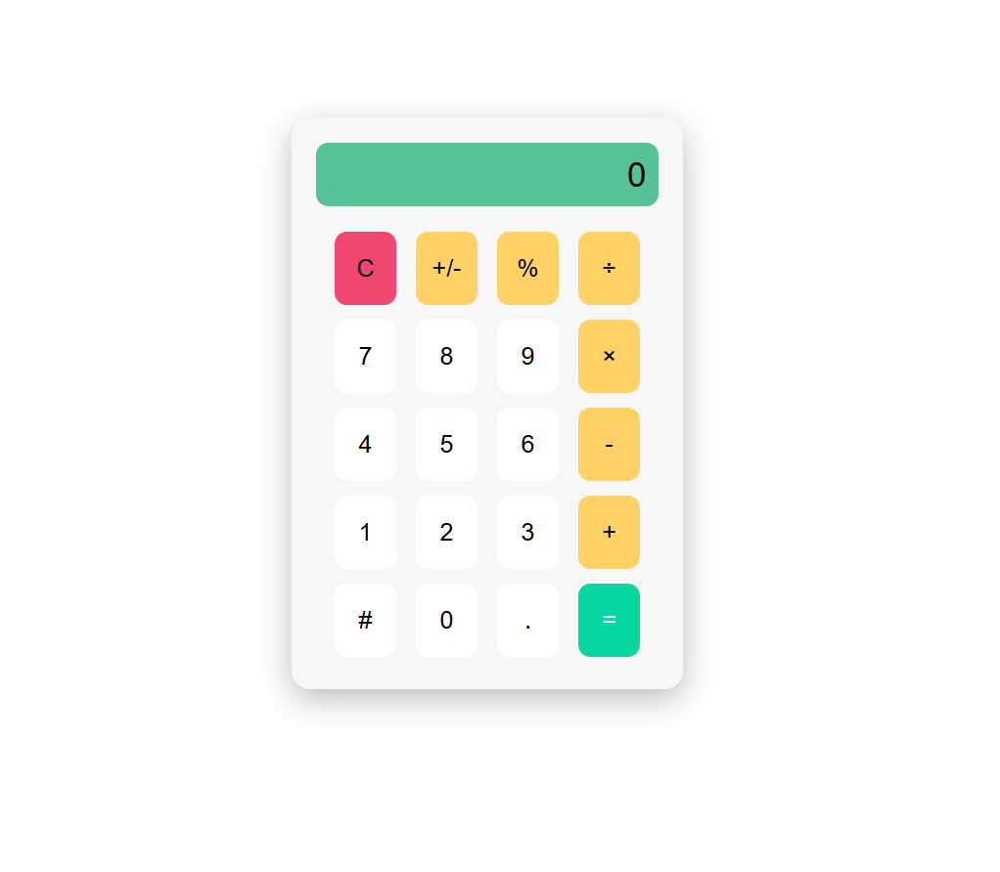

# Calculator App

A simple calculator built using HTML, CSS, and JavaScript.

## Features

- Basic arithmetic operations
- Clean and responsive UI
- Modern button layout
- User-friendly design

## Technologies Used

- HTML5
- CSS3
- JavaScript

## Screenshot

## Screenshot

## How to Run

1. Clone the repository
2. Open the project folder
3. Run `index.html` in your browser

## Author

Adrija Choudhury